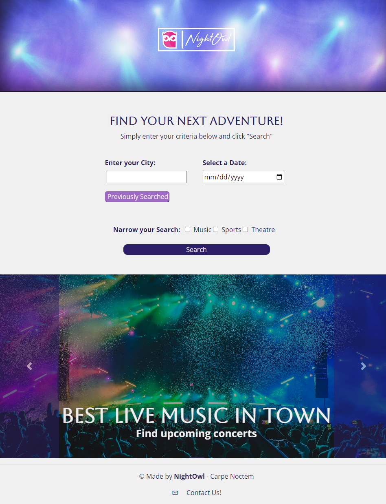
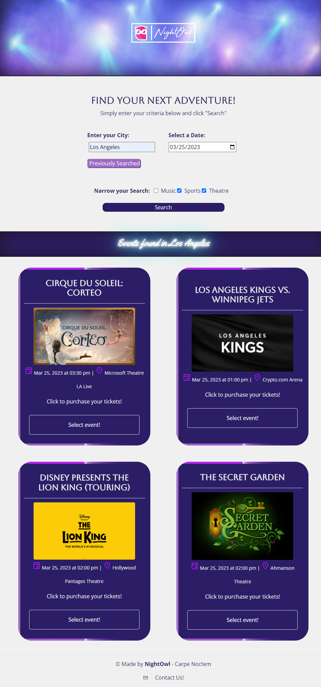

# Night Owl

## Description

NightOwl is an application designed to make event and dining recommendations based on the user's location and selected preferences. The app allows users to discover nearby events and restaurants based on input selections, such as city, date, and event types.


## Table of Contents

- [User Story](#user-story)
- [Mock Up](#mock-up)
- [Deployed Application](#deployed-application)
- [Features](#features)
- [Credits](#credits)
- [License](#license)

## User Story

```
As person wanting a night out,
I want to find events and restaurants and bars near my chosen event in my city
so that I can plan my evening.
```

## Mock Up

Home page of the application looks like the following image:


The application displays event cards as shown next:


## Deployed Application

**Website link: (https://victoriamcn.github.io/NightOwl/)**

## Features

NightOwl offers a range of features that make it easy for users to explore their city, find exciting events and great dining options. Here are some of the app's key features:

- **Location-based recommendations**: The app uses city location from user input to suggest events and dining options that are close to the user. Users can also search for events and restaurants in other locations by entering another city name.

- **Event recommendations**: Users can browse events by categories "Music", "Sports", and "Arts & Theatre". They can also filter events by date, time, and location.

- **Dining recommendations**: The app will automatically provide a list of dining options that are near the user's selected event.

## Credits

### Collaborators

- [Anabel Espinoza](https://github.com/Anabel-Espinoza)
- [Chris Ramsey](https://github.com/c-ramsey)
- [Derek Sutton](https://github.com/dereksutton)
- [Matthew Standish](https://github.com/MatthewStandish)
- [Victoria McNorrill](https://github.com/victoriamcn)

### Third-Party Assets

***APIs**

- [Ticketmaster Discovery API](https://developer.ticketmaster.com/products-and-docs/apis/discovery-api/v2/)
- [Local Business Data](https://rapidapi.com/letscrape-6bRBa3QguO5/api/local-business-data/)
- [day.js](https://day.js.org/docs/en/installation/browser)
- [Google Fonts](https://fonts.google.com/share?selection.family=Pacifico|Source+Sans+Pro:ital,wght@0,400;0,600;1,300|Yellowtail)

**CSS Framework**

- [Bootstrap](https://getbootstrap.com/docs/5.3/getting-started/introduction/)

### Tutorials

***Styling and Design***

- mdBootstrap: [Hero Image with Overlaying Text](https://mdbootstrap.com/docs/standard/extended/hero/#section-background-image-with-navbar)
- CSS-Tricks: [How to Create Neon Text with CSS](https://css-tricks.com/how-to-create-neon-text-with-css/)
- Image Color Picker: [Based on Photo](https://imagecolorpicker.com/)

### Special Thanks To:

*** Georgia Tech Coding Bootcamp ***

Our instructor, [Saurav Khatiwada
](https://github.com/khatiwadasaurav)!

*** Unsplash Photographers ***

- Contact Festival | Marshmello | BC Place, Vancouver, Canada | 2017 by [Aditya Chinchure](https://unsplash.com/@adityachinchure)
- The Hall on Franklin. Tampa, FL. by [Alex Haney](https://unsplash.com/@alexhaney)
- (untitled - arena image) by [JC Gellidon](https://unsplash.com/@jcgellidon)
- MS Dockville Festival in Hamburg, Germany by [Pablo Heimplatz](https://unsplash.com/@pabloheimplatz)
- Fair Park Avenue, Los Angeles by [Steven Lozano](https://unsplash.com/@stevenlozano)


## License

1. MIT License: [Link here.](https://github.com/victoriamcn/NightOwl/blob/main/LICENSE)
2. UnSplash License: [Link here.](https://unsplash.com/license)